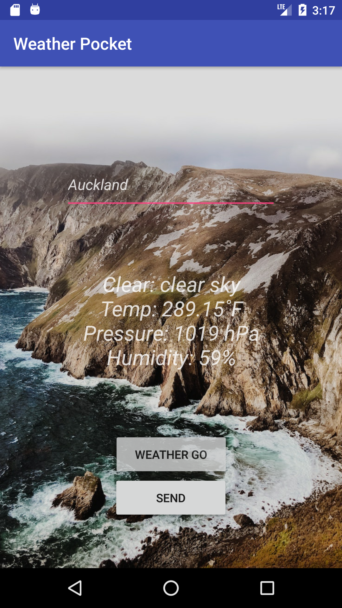
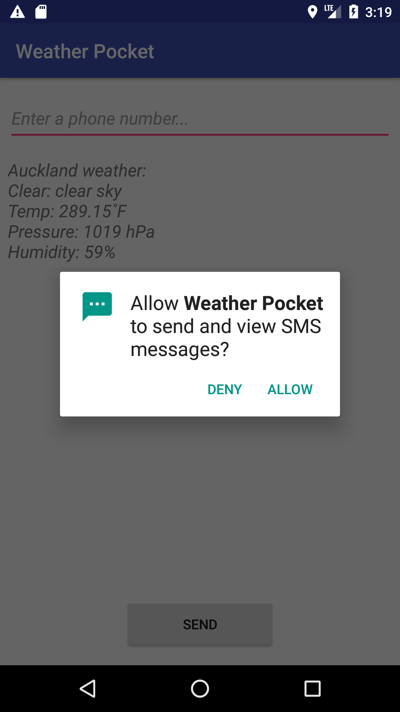
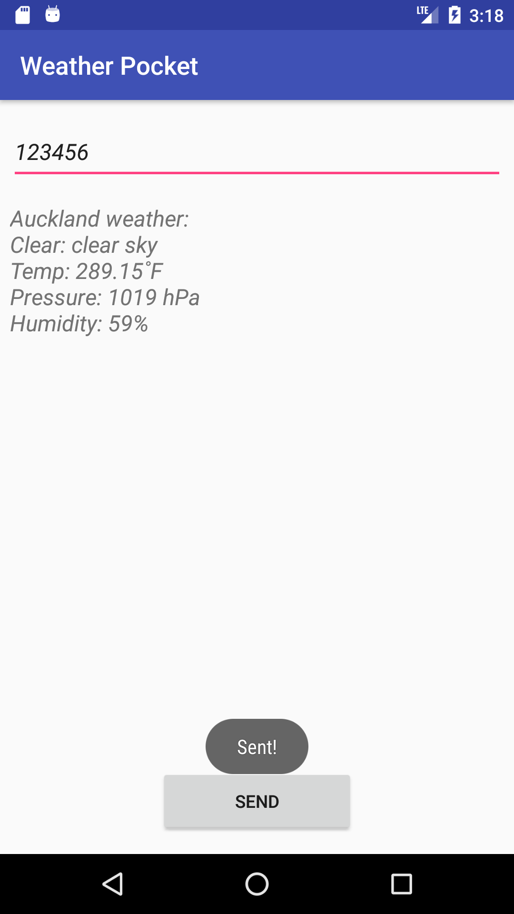

# Weather-Pocket

An android weather application using a third party API to fetch the data from JSON files. 
It also includes the feature to send a SMS message of the weather content to other people

## Demo

## Features
- RESTful API
- SMS service
- JSON
